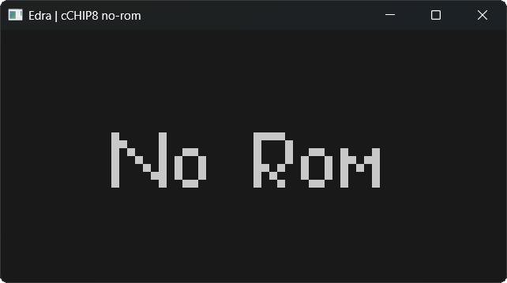

# Edra

## How to compile:
- specify SDL3_DIR / SDL3_TTF_DIR in the build cache of CMake if needed.
- run make b{platform}{d/r} for an automated build.
    - platforms:
        - w - Windows
        - u - Unix
    - d / r -> debug / release.
- make r for an automated run.

## Preview:

  

## Part of this project:
- [auxum](https://github.com/solomonarul/auxum), an utility library as a git submodule.
- [cbf](https://github.com/solomonarul/cbf), agnostic BrainFuck emulation as a git submodule.
- [cchip8](https://github.com/solomonarul/cchip8), agnostic CHIP8 emulation as a git submodule.

---

<a href="https://brainmade.org/">
    Made with <3 by a human.
    
</a>